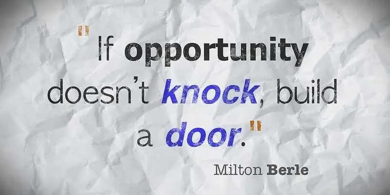

# Progetto a gruppi - HTML/CSS/JS

Questa esercitazione ha lo scopo di permettere lo svolgimento di un progetto a gruppi.

## Come funziona? 

Alla pubblicazione di questa REPL, vi è stato chiesto di formare dei gruppi e soltanto i
membri dei gruppi hanno accesso allo stesso spazio di lavoro.

### Cosa bisogna fare?

Se vi è stata assegnata questa esercitazione, significa che voi (e il vostro eventuale gruppo) dovete
implementare un progetto

### Per i dettagli del progetto?

Se il progetto ha una consegna, verrà specificato dall'insegnante, anche modificando queste istruzioni.

Se non vi è una consegna specifica, significa che il progetto da consegnare lo decidete voi.

## Requisiti generici per progetto personale

- Deve essere creato usando `HTML5/CSS3/Javascript` nella misura spiegata finora a lezione
- Deve essere costituito da almeno 2 pagine HTML che svolgono due funzionalità diverse
- Questa esercitazione deve contenere un sito vetrina di un progetto inventato da voi
- &Egrave; caldamente consigliato l'uso di Bootstrap 5
- La eventuale gestione del tema scuro non è obbligatoria ma aumenta la valutazione
- Si consiglia la pulizia del codice, in quanto parte integrante della valutazione

### Non ho idee, come posso fare?

Qualora non aveste idee, il docente procederà ad assegnare un progetto di ufficio, anche se in realtà
invitiamo tutta la classe a discutere su chi vorrebbe fare cosa.

#### Qualche esempio?

I progetti di solito si dividono in più categorie:

- e-commerce (es. ti vendo la Tastiera figa/Esperienza di viaggio/etc...)
- Prodotti in abbonamento (es. Spotify Premium, Fortnite Battle Pass, etc...)
- Prodotti SaaS (Software as a service, per esempio Adobe Cloud)
- Altro

Se avete dubbi su quale modello di partenza usare, l'insegnante sarà a vostra disposizione per 
aiutarvi
